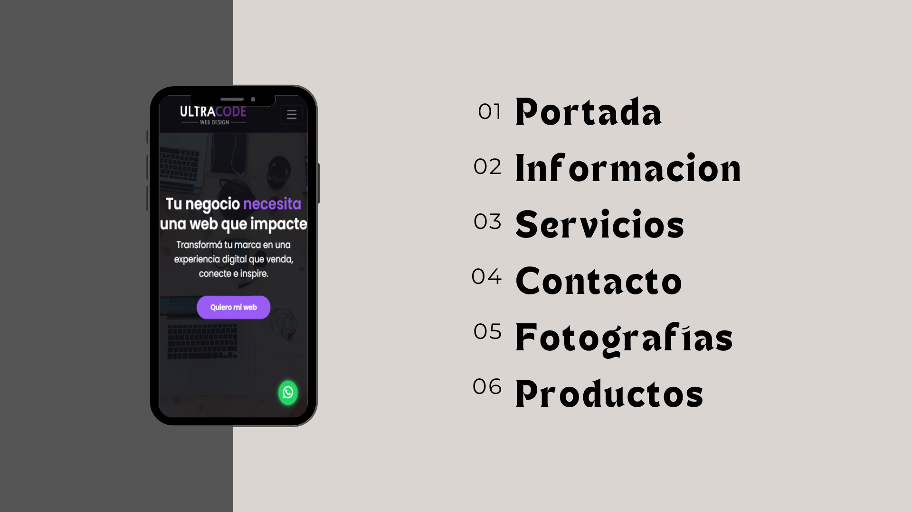
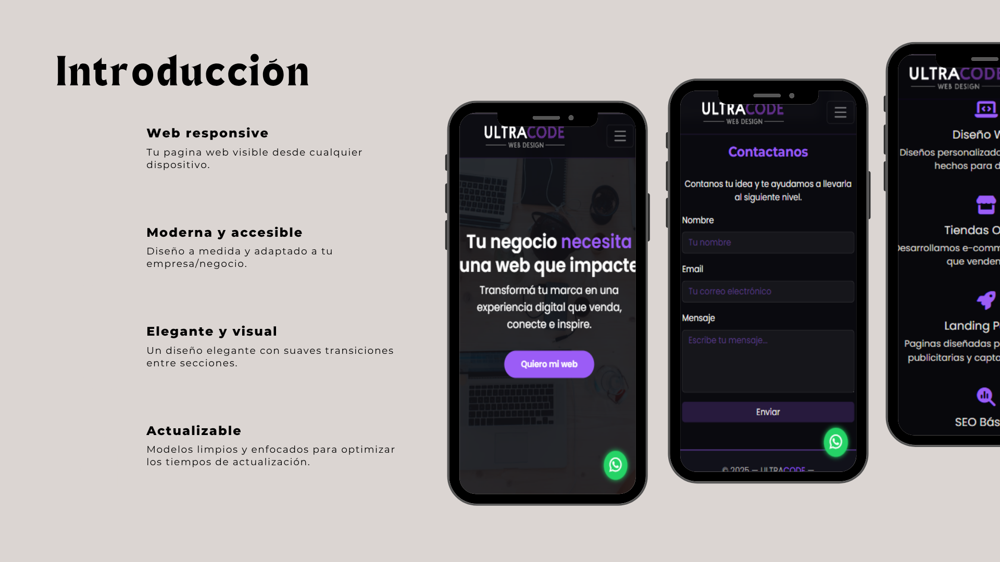
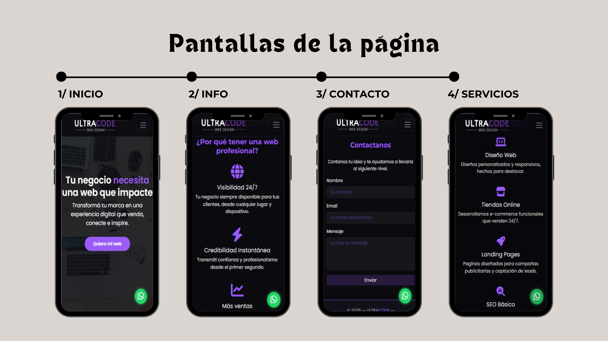

<!DOCTYPE html>
<html lang="es">
  <head>
    <meta charset="UTF-8" />
    <meta name="viewport" content="width=device-width, initial-scale=1.0" />
    <title>Ultra Code | Diseño Web Profesional</title>
    <link
      href="https://cdn.jsdelivr.net/npm/bootstrap@5.3.2/dist/css/bootstrap.min.css"
      rel="stylesheet"
    />
    <link
      rel="stylesheet"
      href="https://cdnjs.cloudflare.com/ajax/libs/font-awesome/6.5.0/css/all.min.css"
    />
    <link
      href="https://fonts.googleapis.com/css2?family=Poppins:wght@400;600&family=Montserrat:wght@700&display=swap"
      rel="stylesheet"
    />
    <link rel="stylesheet" href="css/style.css" />
  </head>
  <body>
    <nav class="navbar navbar-expand-lg navbar-dark fixed-top">
      

        
        <button
          class="navbar-toggler"
          type="button"
          data-bs-toggle="collapse"
          data-bs-target="#navbarNav"
        >
          
        </button>
        

          <ul class="navbar-nav">
            <li class="nav-item">
              <a class="nav-link" href="#benefits">Beneficios</a>
            </li>
            <li class="nav-item dropdown">
          <a class="nav-link dropdown-toggle" role="button" data-bs-toggle="dropdown" aria-expanded="false">
            Servicios
          </a>
          <ul class="dropdown-menu">
            <li><a class="dropdown-item" href="#services">Basicos</a></li>
            <li><a class="dropdown-item" href="servicios.html">Promociones</a></li>
          </ul>
        </li>  
            </li>
            <li class="nav-item">
              <a class="nav-link" href="#contact">Contacto</a>
            </li>
          </ul>
        

      

    </nav>
    <header
      class="hero d-flex align-items-center justify-content-center text-center"
    >
      

        <h1 class="display-4 fw-bold">
          Tu negocio necesita una web que impacte
        </h1>
        

          Transformá tu marca en una experiencia digital que venda, conecte e
          inspire.
        

        <a href="#contact" class="btn btn-cta mt-3">Quiero mi web</a>
      

    </header>
    <!-- CARROUSEL -->
            

  

    

      
    

    

      
    

    

      
    

    

      
    

  

  <button class="carousel-control-prev" type="button" data-bs-target="#carouselExampleAutoplaying" data-bs-slide="prev">
    
    Previous
  </button>
  <button class="carousel-control-next" type="button" data-bs-target="#carouselExampleAutoplaying" data-bs-slide="next">
    
    Next
  </button>

        <!-- FIN CARROUSEL -->
    <section id="benefits" class="py-5 text-center">
      

        <h2 class="section-title">¿Por qué tener una web profesional?</h2>
        

          

            <i class="fa-solid fa-globe fa-3x mb-3"></i>
            <h5>Visibilidad 24/7</h5>
            

              Tu negocio siempre disponible para tus clientes, desde cualquier
              lugar y dispositivo.
            

          

          

            <i class="fa-solid fa-bolt fa-3x mb-3"></i>
            <h5>Credibilidad Instantánea</h5>
            

              Transmití confianza y profesionalismo desde el primer segundo.
            

          

          

            <i class="fa-solid fa-chart-line fa-3x mb-3"></i>
            <h5>Más ventas</h5>
            

              Convertí visitantes en clientes reales con un diseño optimizado
              para vender.
            

          

        

      

    </section>
     
    <section id="services" class="py-5">
      

        <h2 class="section-title">Lo que hacemos</h2>
        

          

            <i class="fa-solid fa-laptop-code fa-2x mb-3"></i>
            <h5>Diseño Web</h5>
            
Diseños personalizados y responsivos, hechos para destacar.

          

          

            <i class="fa-solid fa-store fa-2x mb-3"></i>
            <h5>Tiendas Online</h5>
            
Desarrollamos e-commerce funcionales que venden 24/7.

          

          

            <i class="fa-solid fa-rocket fa-2x mb-3"></i>
            <h5>Landing Pages</h5>
            

              Paginas diseñadas para campañas publicitarias y captación de
              leads.
            

          

          

            <i class="fa-solid fa-magnifying-glass-chart fa-2x mb-3"></i>
            <h5>SEO Básico</h5>
            
Tu web visible en Google desde el primer día.

          

        

      

    </section>
    <section
      class="cta-section d-flex align-items-center justify-content-center text-center"
    >
      

      

        <h2>Tu negocio merece una web que lo represente</h2>
        

          Es hora de dar el salto digital. Nosotros te ayudamos a hacerlo bien.
        

        <a href="#contact" class="btn btn-cta">Solicitá tu presupuesto</a>
      

    </section>
    <section id="contact" class="py-5 text-center">
      

        <h2 class="section-title">Contactanos</h2>
        
Contanos tu idea y te ayudamos a llevarla al siguiente nivel.

        <form
          action="https://formspree.io/f/xblzeqyo"
          method="POST"
          class="contact-form mx-auto text-start"
        >
          

            <label class="form-label text-light">Nombre</label>
            <input
              type="text"
              name="name"
              class="form-control form-dark"
              placeholder="Tu nombre"
              required
            />
          

          

            <label class="form-label text-light">Email</label>
            <input
              type="email"
              name="email"
              class="form-control form-dark"
              placeholder="Tu correo electrónico"
              required
            />
          

          

            <label class="form-label text-light">Mensaje</label>
            <textarea
              name="message"
              class="form-control form-dark"
              rows="4"
              placeholder="Escribe tu mensaje..."
              required
            ></textarea>
          

          <button class="btn btn-accent w-100" type="submit">Enviar</button>
        </form>
      

    </section>
    <footer class="text-center py-4">
      
© 2025 — ULTRACODE — 

    </footer>
    <a href="https://wa.me/5493516618422" class="whatsapp" target="_blank">
      <i class="fab fa-whatsapp"></i>
    </a>
    
    
  </body>
</html>
